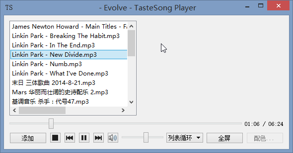
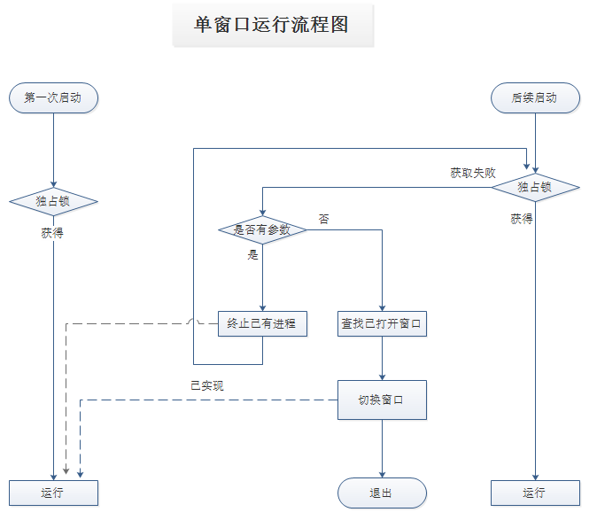

# TasteSongPlayerExplore
该项目是 TasteSong Player 探索期项目，基于Qt官方的player示例，增加了单窗口运行、播放列表（sqlite）、保存音量、播放器模式设置等，支持拖拽批量添加文件。

## 界面

## 开发环境

本地环境是MinGW，IDE用的Qt creator + Clion，Qt creator 仅用于编译，Clion中写代码。

注意CMakeLists.txt，仅仅为了实现语法高亮而引入了Qt的库，没有测试是否能够编译。但QtMultiMedia引入失败，有部分会有语法错误提示。

## 跨平台
由于最后加入的单窗口运行使用了windows API，没有做跨平台处理，最新的dev分支已不能在非win平台编译。

## 后续项目
项目本身只是为了学习Qt，实现基本的播放器功能，后续较完整功能的播放器，在另一个项目中：

https://github.com/lanceleefeng/TasteSongPlayer

## Others
images.git文件夹中的图片不是项目图片，是git说明文档中用的.

### 单窗口运行流程图

